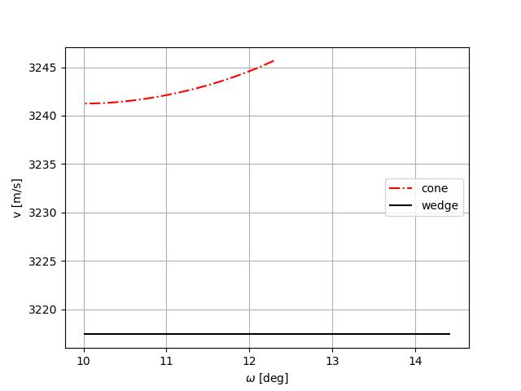
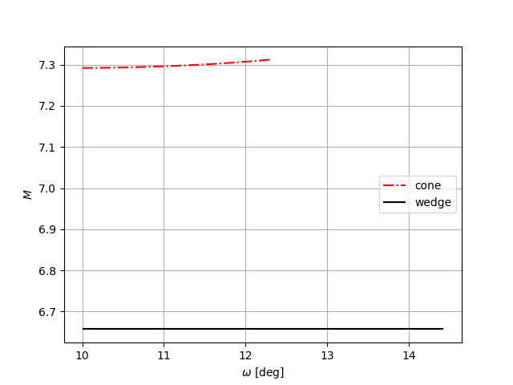

# Conical Flow

## Taylor Maccoll equation

Let us consider the flowfield of a supersonic cone. If we assume that:

- the flow is non viscous, nor reacting
- the flowfield is completely supersonic
- the cone shock wave is attached
- the cone has zero angle of attack $\alpha$

We can simplify the Euler equations, by expressing them in the spherical reference frame
originating from the cone. In fact, in these settings, for the symmetry of the problem
the shock wave is conical and concentric to the cone, so that the flow is homoentropic
and thus the flow field doesn't depend on the azimuth angle and the velocity in that
direction is null. Furthermore, the thermofluid dynamic properties of the flow 
don't depend on the radial coordinate.
So we obtain the Taylor-Maccoll equations: 
$$
\begin{aligned}
\frac{dv_r}{d\omega}&= v_w\\
\frac{dv_\omega}{d\omega}&=\frac 1 {C - 2v_\omega²}[2v_w v_r \frac{dv_r}{d\omega} -C(2v_r + v_\omega\cot(\omega))]\\
\end{aligned}
$$
Where $v_r$ and $v_\omega$ are the velocity components divided by $V_{lim} = \sqrt{2H}$ and
$C= \frac {\gamma-1} 2 (1 - v_r^2 - v_\omega^2)$.  
This set of equation can be numerically solved but the peculiar aspect of it are
the boundary conditions: to integrate this system we must know the velocity components
$v_r (\omega)$ and $v_\omega (\omega)$, after the shock but that shock
angle is unknown. This lead to a iterative procedure to find 
the appropriate shock angle for a given cone.

### Numerical procedure

To solve the Taylor Maccoll equation the following numerical procedure can be 
adopted:

1) Integrate the Taylor Maccoll equations with an appropriate ODE solver, starting
from a given shock angle $\beta$, and stop the integration when $v_w=0$, the $\omega$
angle at which $v_w=0$ is the cone angle $\delta_c$ that realizes that shock angle$\beta$ 
2) Then we can use a root-finding algorithm on the error function: 
   $$
   e(\beta)= \omega_{fin}(\beta)-\delta_c
   $$
   The $\beta$ obtained is the shock angle for the specified cone, with $\delta_c$.

>**note**: the implementation in the code is with a secant method, varying the initialization
of the algorithm we can get the strong or the weak solution for the shock angle,
however this method does not guarantee the convergence to the solution for any possible
initialization

## maximum cone angle $\delta_c$ at fixed $Ma_\infty$

The maximum cone angle $\delta_c$ is the angle that realize a Mach number equal to
one downstream the shock.  
We can adopt the following strategy to find it:

1) Let us define the error function $f(Ma_\infty , \beta) = M_2 -1$
2) find the angle $\beta$ such that $f=0$ 
3) Solve the Taylor-Maccoll equation with $\beta$ calculated at the preceding step, 
from the solution we get $\delta_{c,max}$

In fig. {@fig:betadelta} we can see a plot of the results.

{#fig:betadelta width=80%}

## Mach number independence

If we consider a supersonic cone, for sufficiently large free stream Mach number
$M_\infty$ some thermofluid dynamic properties of the flow are not influenced by it,
in essence we can consider valid the hypersonic limit relations.
This effect is demonstrated on the pressure coefficient of the supersonic cone in
fig. {@fig:cpM, where we can see that its value doesn't depend on $M_\infty$ but only from
$\delta_c$ cone angle.

{#fig:cpM width=80%}

## Comparison: wedge and cone flow
We can compare the thermofluid dynamic properties of the downstream flows past a 
wedge and a cone that impose the same flow deviation $\delta = 10 [deg]$ and free
stream Mach number $M_\infty = 10$.  
The properties of the free stream air, used for the subsequent simulation, are reported in the following table:

|||
|---|---|
|$M_\infty$| 10|
|$\gamma$| 1.4|
|R|287.05|
|T [K]|273.0|
|$\rho$ [kg/m^3]|0.129|
|P [Pa]| 10132.5| 
|n | 5|

We can appreciate the different velocity, Mach, Temperature, Pressure, density 
distribution, along the $\omega$ angle up to the cone/wedge, from fig. {@fig:v} to {@fig:rho}.  
We can state that overall for fixed $\delta$
and $M_\infty$ the wedge shock is stronger than the cone shock.

{#fig:v width=70%}

{#fig:M width=70%}

{#fig:T width=70%}

{#fig:P width=70%}

{#fig:rho width=70%}

<!-- commented out some of the paper that was out of context  
## aerodynamic coefficients

We can calculate the $c_p$ distribution of a supersonic cone. Because of the genesis of these methods, the $c_p$ 
distribution depend only on the $\phi$ coordinate, with this observation we can
express the aerodynamic force divided by the free stream dynamic pressure:
$$
\frac F {q_\infty}= \int_0^R \int_0^{2\pi}  c_p(\phi) \frac r {sin(\delta_c)}drd\phi = \frac {R^2} {2 sin(\delta_c)} \int_0^{2\pi} c_p(\phi) d\phi
$$
It is worth noting that these methods only give decent results for small angle of 
attack

### $C_{Fx}$ and ${C_{Fy}}$ calculation

The $x$ axis coincide with the cone axis and so the force for unit dynamic pressure 
$F_x$ is given by eq. (2).  
To get the force for unit dynamic pressure along the $y$ axis we must project
the radial aerodynamic force onto the $y$ axis thus, obtaining eq. (3).
The reference area of the base of the cone
$$
C_{F_x}= \frac {F_{x}}{\pi R^2} = 
\frac {1}{2\pi} \int_0^{2\pi} c_pd\phi \tag {2}
$$

$$
C_{F_y}= \frac {F_{y}}{ \pi R^2} = 
\frac {1}{2\pi \tan(\delta_c)} \int_0^{2\pi} c_p\cos(\phi)d\phi
\tag{3}
$$

These two integrals can be numerically evaluated once the $c_p$ distribution
is known.

### $C_l$ e $C_d$ calculation

$C_l$ e $C_d$ can be evaluated with the following relations:

$$
\begin{aligned}
C_d&= C_{F_x}\cos(\alpha) + C_{F_y}\sin(\alpha) \\
C_l&= -C_{F_x}\sin(\alpha) + C_{F_y}\cos(\alpha)\\
\end{aligned}
$$
-->
