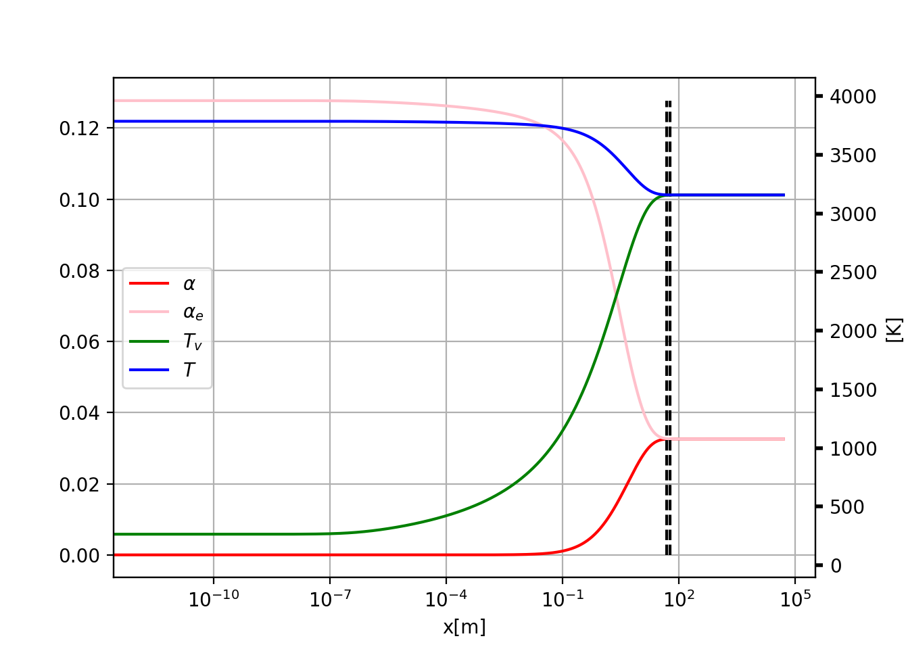

# Evaluation of the Relaxation layer past a Normal shockWave using Monti-Napolitano model

Downstream a Normal shock wave, whose upstream mach number is in the hypersonic regime,
the flow can reach high enough temperatures that don't allow us to consider the 
gas in thermodynamic equilibrium.   
We have to consider the finite rate chemical processes that modify the 
thermofluid dynamics properties of the gas.  
In particular, we can address the importance of this chemical processes on the flow
by evaluating the Damkoeler number:

$$Da=\frac{\text{transport time species}}
{\text{chemical reaction time}}=\frac{t_m}{t_r}$$

and we can define 3 limiting cases:
- $Da<<1$, frozen gas
- $Da\simeq 1$, non equilibbrium
- $Da>>1$, istantaneous equilibrium

since the shock wave is only a few mean free
path thick, the gas can be considered in a frozen state, thus the Rankine-Hugonoit
equations do apply.  
Then the gas evolves towards equilibrium.  
When the gas is air whe should account for th following processes that take place in the flow field:
- exitation of vibrational state of $N_2$
- dissociation of $O_2$, $N_2$, and subsequent formation of atomic oxigen, nitrogen
and $NO$ 
- ionization

However depending on the temperature reached in the flow field, not all of these
processes might be relevant.

## Monti-Napolitano model

The model is simplyfied by the assumption that $N_2$ does
not dissociate and no ionization is involved.
It is valid for a range of temperature well above the vibrational temperature
of $O_2$, $T_v=2279K$ and well below the dissotiation temperature of $N_2$, $T_d=113159K$.  
For the problem of the relaxation layer past a normal shock wave, this model is 
accurate enough for shock such that:
$$\frac {T_2}{T_1}<15 \quad \frac{\rho_2}{\rho_1}<10$$
And thus limits its applicability for a specific set of range of altitudes and Mach number.
This model assumes that:

- the vibrational, rotational and translational degrees of freedom of $O_2$, 
the translational, rotational degrees of freedom of $N_2$, the translational d.o.f
of $O$ are in equilibrium at temperature T
- the vibrational degrees of freedom of $N_2$ are in equilibrium at temperature $T_v$
- for the vibrational d.o.f of $O_2$ is used the partition function of the Lighthill oscillator
- the dissociation of $O_2$ is characterized via the mass fraction $\alpha$,
and $T_\alpha$ is representative of the dissociation energy of the molecular oxygen

So it can be considered a model defined by 3 temperature.
The equation to describe the evolution of the $T_v$ and $\alpha$ are described 
in the following section.

### Chemical rate equation

We must consider the following reactions, at varying $M$, 

$$O_2 + M  \leftrightarrow 2O + M$$

thus we have 3 reactions, for $M$ equal to $O$, $O_2$ and $N_2$.
the chemical rate equation, expressed via molar concentration is:
$$\frac{d[O]}{dt}=K_d[O_2][M] - K_r[O]^2[M]$$
that can be expressed using the equilibrium constant $K=\frac{K_d}{K_r}$.
$$\frac{d[O]}{dt}=K_r(K[O_2][M] - [O]^2[M])$$
More work is needed to express it using the masss fraction $\alpha$

### vibrational Temperature equation

The evolution of the vibrational Temperature of $N_2$ is described by the following
equation of in the Entropy of the vibrational dof of $N_2$:
$$T_v\frac{dS_v}{dt}=\frac{1}{t_c} [E_v(T) - E_v(T_v)]$$
Which together with the equation of the entropy
$$S=k(1 +\ln\frac Q N )+ \frac{E-E_0}{T}$$

lead to an ODE for $T_v$.

## model and computation

To solve the relaxation layer past a normal shock wave  we  consider the set of 
equations formed by the followings:

- total mass conservation
- momentum balance
- energy conservation
- equation of state of the gas for the pressure
- equation of state of the internal energy
- vibrational Temperature equation
- Chemical rate equation

these form a closed set of equation that can be integrated, for example with a 
runge-kutta method, until equilibrium is reached.

## Results

The relaxation layer was computed for two altitude and mach number.

| Ma  | gamma | R [J/Kg K] | T [K]| rho [Kg/m^3] | p [Pa] | n   | h [km]|
| --- | ----- | ------     | ---  | -----        | ---    | --- | ---   |
| 6.4 | 1.4   | 287.05     | 250  | 0.004        | 290    | 5   | 40    | 
| 8.3 | 1.4   | 287.05     | 264  | 0.002        | 150    | 5   | 45    |

### 40 Km altitude case
In this case we can observe how $T_v$, $T$, $\alpha$ and equlibrium concentration 
of atomic oxigen $\alpha_e$ evolve in the relaxation layer. The location at wich
first $T_v$ reaches $T$ the vibrational d.o.f of nitrogen comes at equilibrium with
the other d.o.f of the gas, we can call this condition partial equilibrium. Much further
also equilibrium in the concentration of atomic oxigen is accomplished.  

{#fig: width=80%}  

the following profiles of the thermo-fluidynamic quantities are obtained

{#fig: width=80%}

{#fig: width=80%}

{#fig: width=80%}

{#fig: width=80%}

We can observe that the evolution of the vibrational d.o.f of $N_2$ influence
much more than $\alpha$ the evolution of  the thermodynamic quantities.
The Temperature $T$ decreases since the excitement of the vibrational state  is
an endothermic reaction.
Most of the overall kinetic energy content of the gas is lost in the 
vibrational excitement, we can see how the velocity $u$ drops as partial equilibrium
is reached, and thus increasing the sensible hentalpy of the mixture.  
Then density and pressure increase because of the conservation of mass and impulse.

### 45 Km altitude case
The behaviour of the thermo-fluid dynamic quantities are similar to the case at 
40 Km.
This time partial and complete equilibrium are accomplished almost at the same location.

{#fig: width=80%}

the following profiles of the thermo-fluidynamic quantities are obtained

{#fig: width=80%}

{#fig: width=80%}

{width=80%}

{width=80%}

### Note
> the fact that vibrational d.o.f equilibrium is systematically reached before the
equilibrium in dissotiation mass fraction $\alpha$ is beacause thermal equilibrium is
fondamentally due to collision between particles and the excitment of the vibrational
d.o.f require far less energy, and thus collisions, in contrast to the dissociation 
reactions
