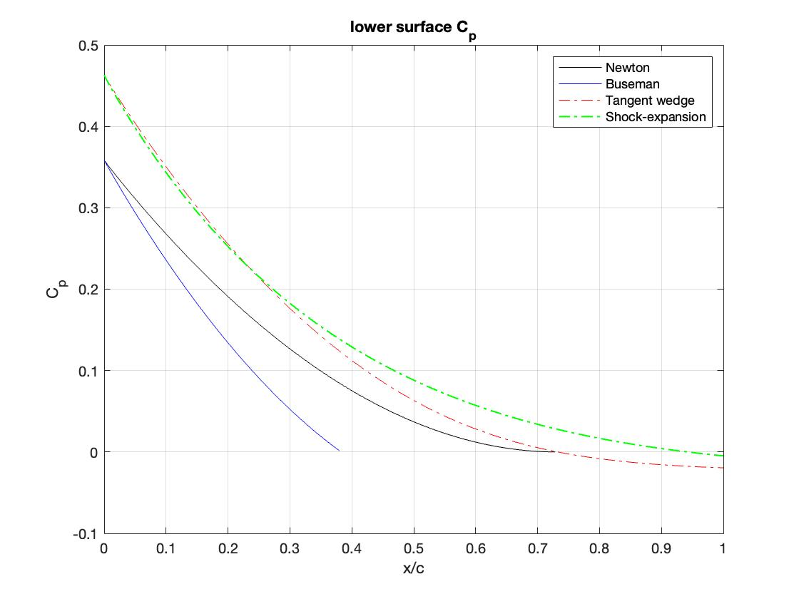
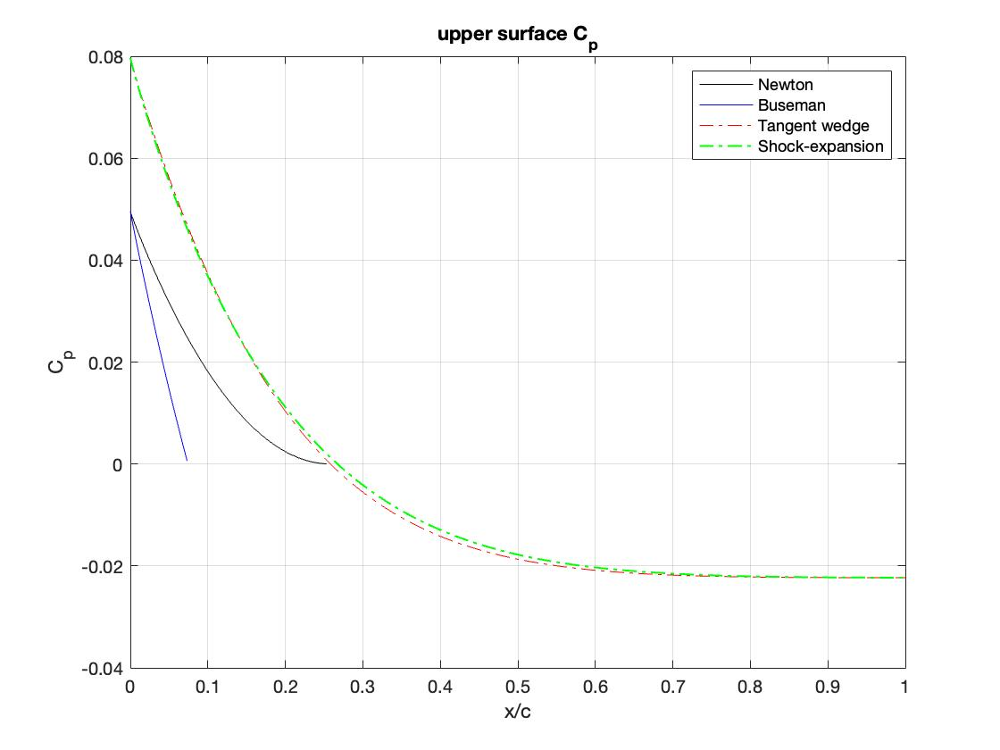

# Approximate theories

## F-104 airfoil

The airfoil profile of the *starfighter* is described by the following cartesian curve: 

$$
\begin{aligned}
y&=\pm \big[- \big(R - \frac{\tau}{2}\big) + \sqrt{R^2 - (x-0.5)^2}\big]\\
R&=\big(\frac{1}{\tau} + \tau \big)\frac c 4 \simeq 1.7 \\
\tau&=0.15\\
c&=1
\end{aligned}
$$  

Given the airfoil geometry and the flow regime it is possible to apply the 
following approxiamte theories:

- Newton
- Newton-Bousemman
- cono-tangente 
- urto-espansione

In the code the airfoil geometry is discretized in a finite number of points $(x,y)$.
In this way it is possible to approximate the profile with a closed polygonal line and
each $i-th$ segment is characterized by the following geometric quantities:

- $P_i=(x_i,y_i)$ 
- $l_i= \sqrt{(x_{i+1} - x_i)^2 + (y_{i+1} - y_i)^2}$
- $\theta_{i_{geom}}= \arctan(\frac{y_{i+1} - y_i}{x_{i+1} - x_i})$

On the leading edge, $\theta_{geom}$ is :
$$
\theta_{geom}= \arctan( \frac{0.5}{\sqrt{R^2 - 0.25}}) \simeq 17°
$$

### Metodo di Newton

With this method the pressure coefficient is given by:
$$
c_p = 2\sin^2(\theta)
$$
Where $\theta$ is the angle that the tangent to each point of the airfoil forms 
with the free stream velocity. Thus, for an airfoil at given angle of attack $\alpha$ 
the pressure coefficiente is $c_p=c_p = 2\sin(\theta_{geom} \pm \alpha)^2$. 
In this model the pressure on the body is the results of the momentum exchange upon 
collision, between the particles and the body itself, without any interaction between
particles and other particles.  
Because of this, for zones where $\theta_{geom} \pm \alpha < 0$ particles do not
collide with the body and the pressure is zero.

### Newton-Busemann method

To account for the airfoil curvature, Busemann proposed a correction to the Newton
method, eq. (1).
$$
c_{p_B}=c_{p_N} \pm \frac 2 R \int_0^y \cos(\theta) dy \tag{1}
$$
Where the $+$ sign holds for concave bodies and the $-$ sign holds for convex bodies.  
For $\theta << 1$ ,i.e. slender bodies with small curvature, $\cos(\theta)\simeq 1$ 
the Busemann formula can be approximated as:
$$
c_{p_B}=c_{p_N} \pm \frac 2 Ry
$$
Furthermore, in the Busemann model, the nature of the fluid structure interaction 
remain the same as in the one of Newton, thus, negative values of $c_p$ do not make
sense.

### Tangent wedge method

By this theory, the $c_p$ in the generic point  $(x,y)$ of the body that is 
in a compression zone ($\theta_{geom} \pm \alpha > 0$)  is the same as the one of
a wedge of angle $\delta_{cuneo}=atan(\frac {dy}{dx})$ in the same free stream
conditions.
The method is valid if:

- for each body point $\delta_{cuneo} \leq \delta_{lim}$
- the body has a sharp leading edge

For body point in expansion zones ($\theta_{geom} \pm \alpha \leq 0$) a Prandtl-Meyer
expansion is considered in place of a shock wave.  
In the limit of the small perturbance theory, the $c_p$ if function of the 
parameter of similarity $K=M_\infty \theta$ (where $\theta$ is $\theta= \theta_{geom}\pm\alpha$)
$$
c_p= \frac {2} {M_\infty^2} \big[K + \frac{n+1}{2n}K^2 \big] + \mathcal O(K^3)  \tag{2}
$$

### Shock-expansion method

In the shock-expansion methdo we account for the interaction of the leading edge 
shock wave and the expansion waves downstream of it.
When we discretize the airfoil, and thus, the infinitesimal stream variations become
finite:

- the bow shock wave becomes piece-wise oblique
-  There are Prandtl-Meyer expansion fan at each finite change of stream direction
- The expansion fans can be thought as concentrated in a single expansion wave, given 
the small change in stream direction $\Delta\theta$

The main approximattion of the method is **ignoring** the succesive interactions
between reflected expansione waves and shock wave.  

To practically evaluate $c_p$ distribution on the airfoil it suffices consider:
-the shock on the leading edge
-the expansion waves along the rest of the airfoil caused by the current deviation
$\delta= \theta-\theta_1$, where $\theta_1$ is the angle by which the stream is 
deflected by the leading edge shock.

$$
\begin{aligned}
\frac p {p_\infty}&= \frac {p_2}{p_\infty}\big|_{shock} \frac p {p_2} \big|_{expansion}\\
\frac {p_2}{p_\infty}&= \frac 1 {n+1} \big((n+2)Ma_\infty^2\sin^2(\beta) -1 \big)\\
\frac p {p_2}&= \big(1+ \big(\frac {Ma_2\delta} n\big) \big)^{n\gamma}
\end{aligned}
$$

Where $\frac {p_2}{p_\infty}$ is calculated one time,  and $\beta$  is the
shock angle of the leading edge shock wave.

### Resuslts

In figs. (1) and (2) we can appreciate a comparison between method of the $c_p$ distribution 
of the upper and lower surface of the airfoil. The free stream Mach number is
$Ma_\infty=8$ and the angle of attack is $\alpha=4$°

{width=70%}  

{width=70%}

## Aerodynamic coefficients calculation

Once the reference frame of the airfoil is fixed the can compute the aerodynamic
coefficient as follow:

$$
\begin{aligned}
c_{F_x}&= \int_\gamma c_p \boldsymbol n\cdot \boldsymbol i dl =  \int_\gamma c_p \cos(\theta \pm \frac \pi 2) dl \\
c_{F_y}&= \int_\gamma c_p \boldsymbol n\cdot \boldsymbol j dl = \int_\gamma c_p \sin(\theta \pm \frac \pi 2) dl  \\
\end{aligned}
$$
$$
\begin{aligned}
c_d&= c_{F_x}\cos(\alpha) + c_{F_y}\sin(\alpha) \\
c_l&= -c_{F_x}\sin(\alpha) + c_{F_y}\cos(\alpha)\\
\end{aligned}
$$

