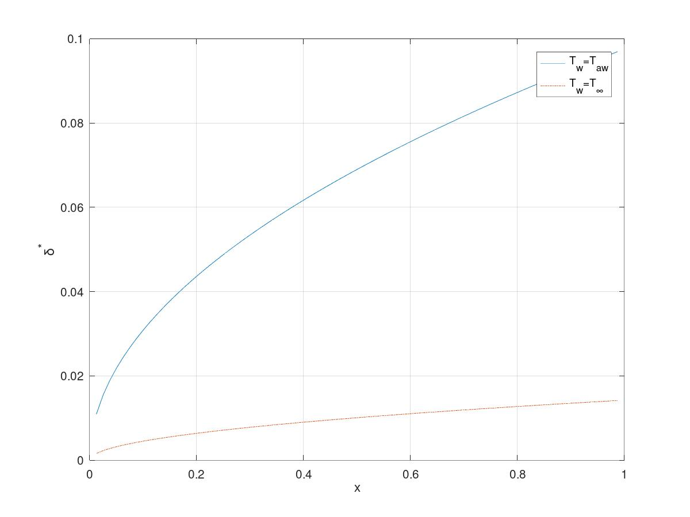
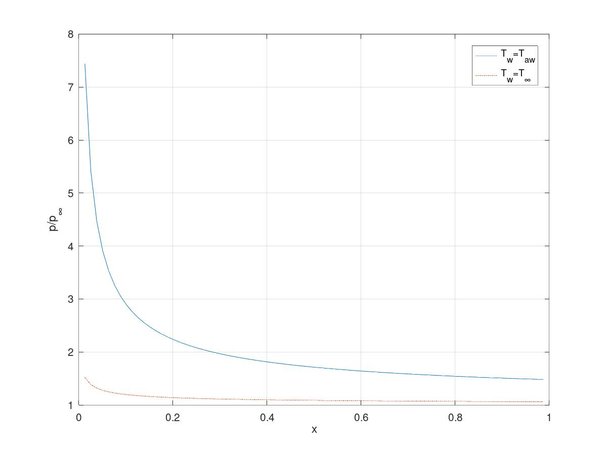
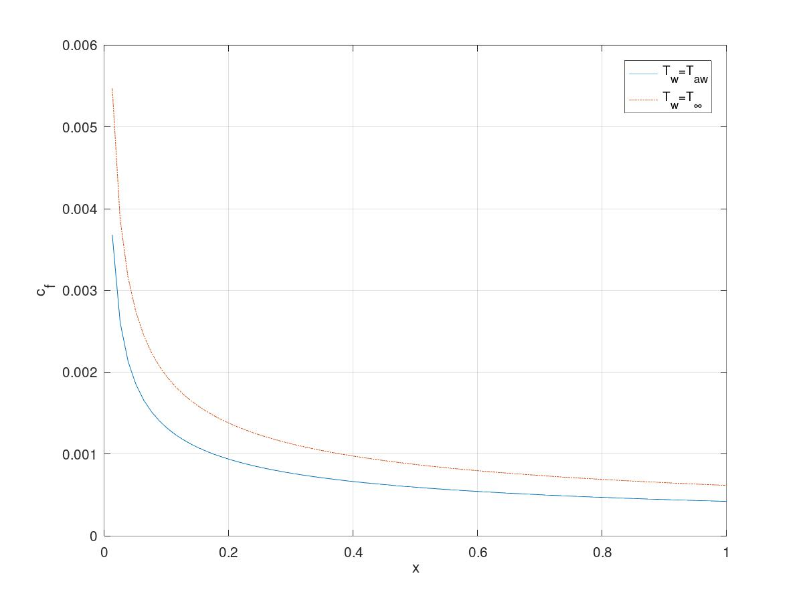
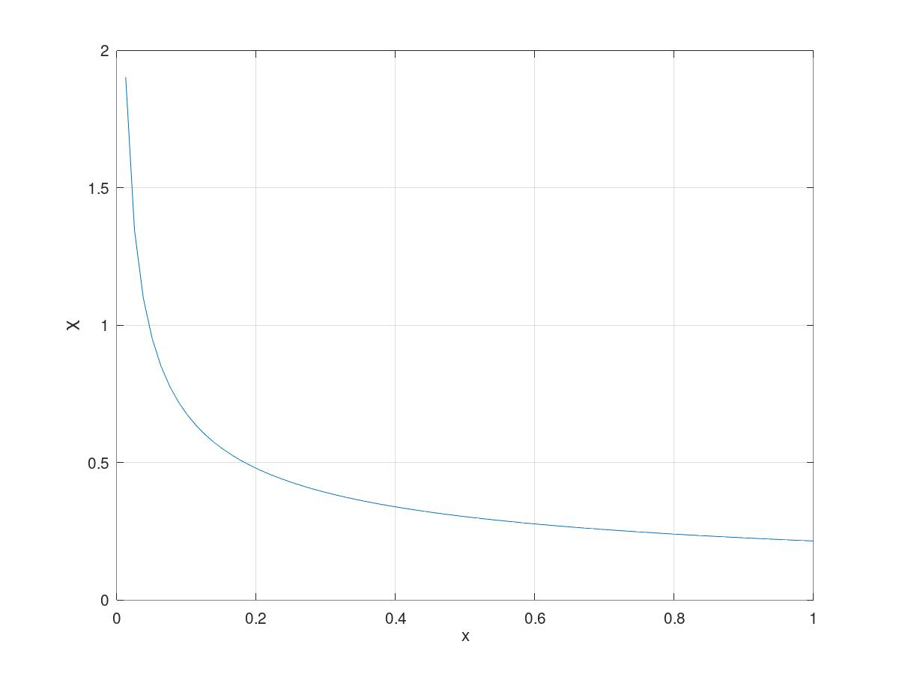

# Viscous interaction

One possible way to compute boundary layers parameters is the viscous interaction
method.  
It is an approximate method, because it relays on integral parameters (i.e. $\delta^*$),
and to calculate the skin friction coefficient we must use empirical formulas.  
The name viscous interaction refers to the fact that by the apparent thickness $\delta^*$ 
the boundary layer interact with pressure field outside the boundary layer, and thus,
it may or may not affect it enough to influence the boundary layer itself.  
The parameter that give us a measure of the strength of the viscous interaction is
$\chi$, defined as:
$$
\chi = M_\infty^3 \sqrt{\frac{C_w}{Re_\infty}}
$$

Where $C_w=\rho_w \mu_w/\rho_e \mu_e \simeq 1$.  
We can have three cases:

- $\chi < 1$, there is no viscous interaction, the pressure field outside the 
boundary layer is independent of the boundary layer itself
- $\chi \simeq 1$, weak viscous interaction, the pressure field can still be calculated
independently of the boundary layer, but we must recalculate it after
the "apparent geometry" is known
- $\chi > 1$, strong viscous interaction, the boundary layer and the pressure field
must be resolved simultaneously

## numerical method

We can define a numerical procedure, that can handle bot weak and strong interactions.
It is summarized in these steps:

1) compute the pressure field in the non viscous flow
2) compute $\delta^*$ distribution on the body
3) update body geometry with the $\delta^*$ distribution
4) repeat steps 1), 2), 3) until convergence

## case study: flat plate

To solve the boundary layer of a hypersonic flat plate with viscous interaction
the numerical method is implemented in a Matlab script : `flatePlate.m`.

### formula for the $\delta^*$ calculation

A formula for the calculation of $\delta^*$ obtained by Cox and Crabtree 
(suitable for use in a viscous interaction process) is given here without proof:
$$
\frac{\delta^*}{x}= \frac{\gamma -1}{\gamma +1} (0.664 + 1.73 \frac{T_w}{T_0})
\frac{\chi}{M_\infty}\frac{p_\infty}{p}\frac{1}{\sqrt{x}}\left( \int_0^x \frac{p}{p_\infty} dx \right)^{\frac{1}{2}}
$$

To get an estimate of the skin friction coefficient $c_f$ we can use the Blasius
formula, but we evaluate the thermodynamic properties at $T=T^*$, where $T^*$ 
is the reference temperature.
$$
C_f=\frac{0.664}{\sqrt{Re_{xe}}}\left(\frac{T^*}{T_e} \right)^{(- 1/3)}
$$
And $\frac{T^*}{T_e}$ is given by:
$$
\frac{T^*}{T_e}= 0.42 + 0.032M_e^2 + 0.58\frac{T_w}{T_e}
$$
The local external Reynolds number $Re_{xe}$ is evaluated with $u_e$ in place of $V_\infty$.  
From the momentum balance equation outside the boundary layer and supposing that
the gas is a 2 degree of freedom gas in equilibrium we can work out an expression for
$u_e$, if we also suppose that $T_e = cost$ along the plate.

$$
\begin{aligned}
\frac{d u_e}{dx}&= \frac{1}{\rho_e u_e}\frac{dp_e}{dx} ;\quad p_e=\rho_eRT_e\\
u_e\frac{d u_e}{dx}&= \frac{RT_e}{p_e}\frac{dp_e}{dx}\\
\frac{u^2}{2} -\frac{u_e^2}{2}&= RT_e\ln \left(\frac{p}{p_\infty}\right)\\
\end{aligned}
$$

### Results
The boundary layer of the flat plate has been solved for the following free stream flow:

|data|value|
|:---:|:---:|
| Velocity \[m/s\] | 1840|
| free stream temperature \[K\]   | 235 |
| adiabatic wall temperature \[K\] | 2143|
| free stream pressure          | 574 |
| free stream density \[kg/m3\]             | 8.46e-3 |
| free stream Mach number  | 5.97 |
| free stream Reynolds number | 9.87×e5 |

These represent the thermofluid dynamic conditions of the re-entry of the mercury
capsule at 35 Km of altitude.  
In fiq. (1) we can appreciate the difference in $\delta^*$ distribution between a 
cold and a flat plate, and subsequently the difference in pressure ratio (fig. (2)).  
We can see that the hot plate induce a more pronounced variation of the apparent
geometry with respect to the cold plate, thus the pressure ratio is greater along the
plate.  
In particular, this is crucial when designing hypersonic wind tunnel, so the walls
of the tunnel must be cooled to ensure that the flow in the test chamber isn't 
affected by the wall boundary layers. 
We can also see that the profiles of $\delta^*$ and $\frac{p}{p_\infty}$ are not 
plotted at $x=0$ because there is a singularity in the viscous interaction method.
However, at $x=0$, $\delta^* = 0$ and $\frac{p}{p_\infty}$ is singular.

{width=80%}

{width=80%}

In fig. (3) we can see the skin friction distribution comparison between hot and
cold plate, and because the $c_f$ of the cold plate is point wise greater than the $c_f$ of the hot plate, it has also a greater drag coefficient $c_d$. In fact,
$c_{d,hot}=7.92\times10^{-4}$ and $c_{d,cold}=11.66\times10^{-4}$.

{witdth=80%}

In fig. (4) the $\chi$ distribution of the hot plate is plotted, and we can state that the viscous
interaction is of the weak type ($\chi\simeq 1$), except for the leading edge of the plate.

{width=80%}

